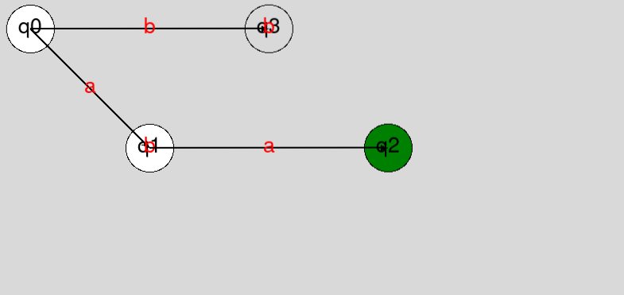

# Universal DFA

It's a program that will help user to display his/her DFA machine, graphically and also check the input string in the given DFA machine.

## Getting Started

### Prerequisites

To use this program you need to install two libraries

- Tkinter
- graphics

#### Tkinter

To install Tkinter you can check the [TkDocs installation tutorial](https://tkdocs.com/tutorial/install.html).

For example in **Debian** base Linux distribution  you can you command bellow.

```
$ sudo apt-get install python3-tk
```

Or in **Arch** base distros you can run the command bellow.

```
$ sudo pacman -Sy yay
$ yay -Sy tk
```

#### graphics.py

Just run the command bellow.

```
$ pip install graphics.py
```

## Usage

To use this program you need to first run it and then give it the **Delta** rules that make a DFA machine. and then a start point and finish point; after you insert this information, program will create a DFA machine and now it's ready to get your string, when you insert the string and hit enter, a graphical interface will pop up and show you your DFA machine and check the string step by step in the DFA machine, if it got to target point (finish point) it will turn to green and else it will become red.

#### Example

run the code.

```
$ python Universal_dfa.py
```


Enter the Deltas in to the program (hit enter if you are done as shown).

```
Please Enter the #1 Delta :q0,a,q1
Please Enter the #2 Delta :q0,b,q3
Please Enter the #3 Delta :q1,b,q1 
Please Enter the #4 Delta :q3,a,q3
Please Enter the #5 Delta :q3,b,q3
Please Enter the #6 Delta :q1,a,q2
Please Enter the #7 Delta :
```

Enter the first state (start point).

```
Please Enter The First State : q0
```

Enter the final states (target points or finish points).

```
Please enter the #0 Final State :q2
Please enter the #1 Final State :
```

Now the DFA machine is ready to use, this will show as the **output**.

```
lines : [['q0', 'q1', 'a'], ['q0', 'q3', 'b'], ['q1', 'q1', 'b'], ['q3', 'q3', 'a'], ['q3', 'q3', 'b'], ['q1', 'q2', 'a']]
states names:  ['q0', 'q1', 'q3', 'q2']
```

Enter your string.

```
Please Enter Your String : aa
```

The string will put into the machine and this will be the final out put as it's draw in the graphical interface.

```
q0
q1
q2
Final State is : q2
String Accepted
```



## Contribute

As you can see, this program is still under manufacture, so fell free to help me make this program more efficient and better.

Thank you all